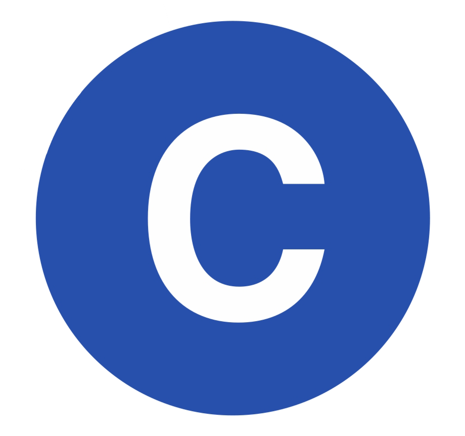
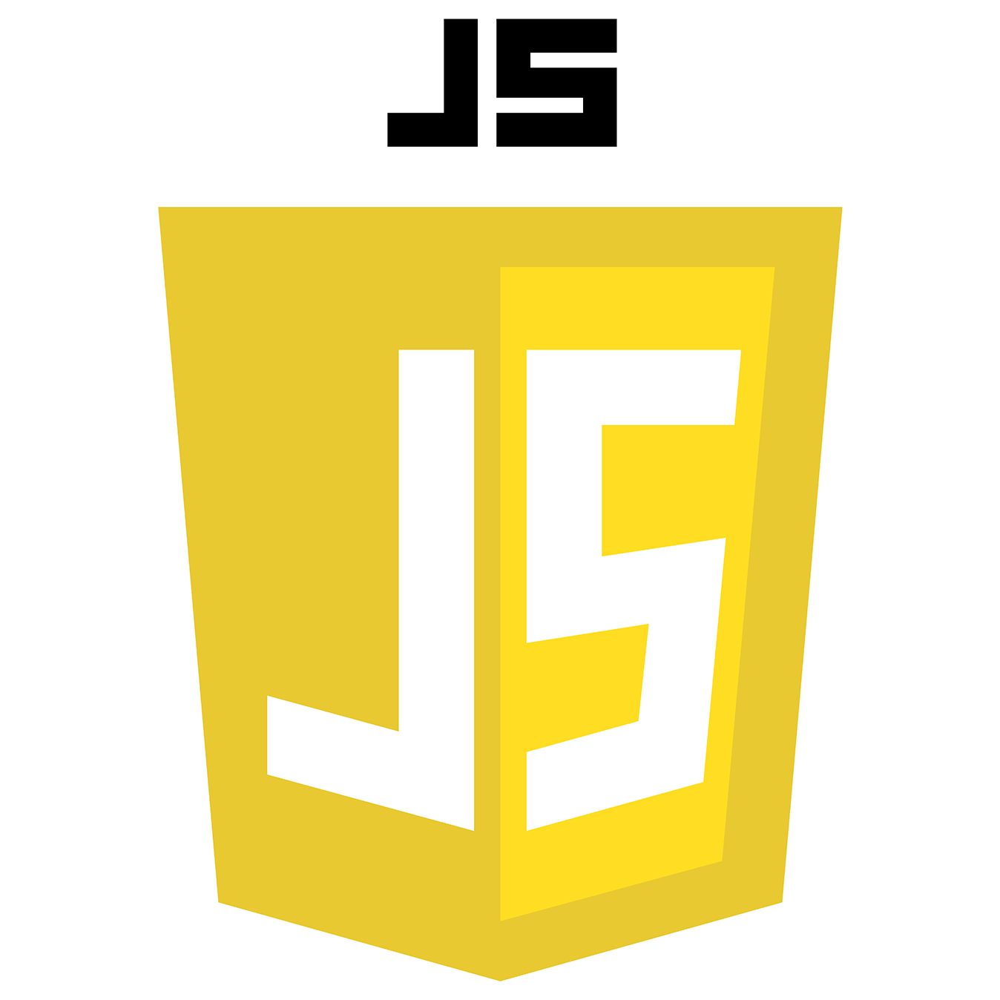
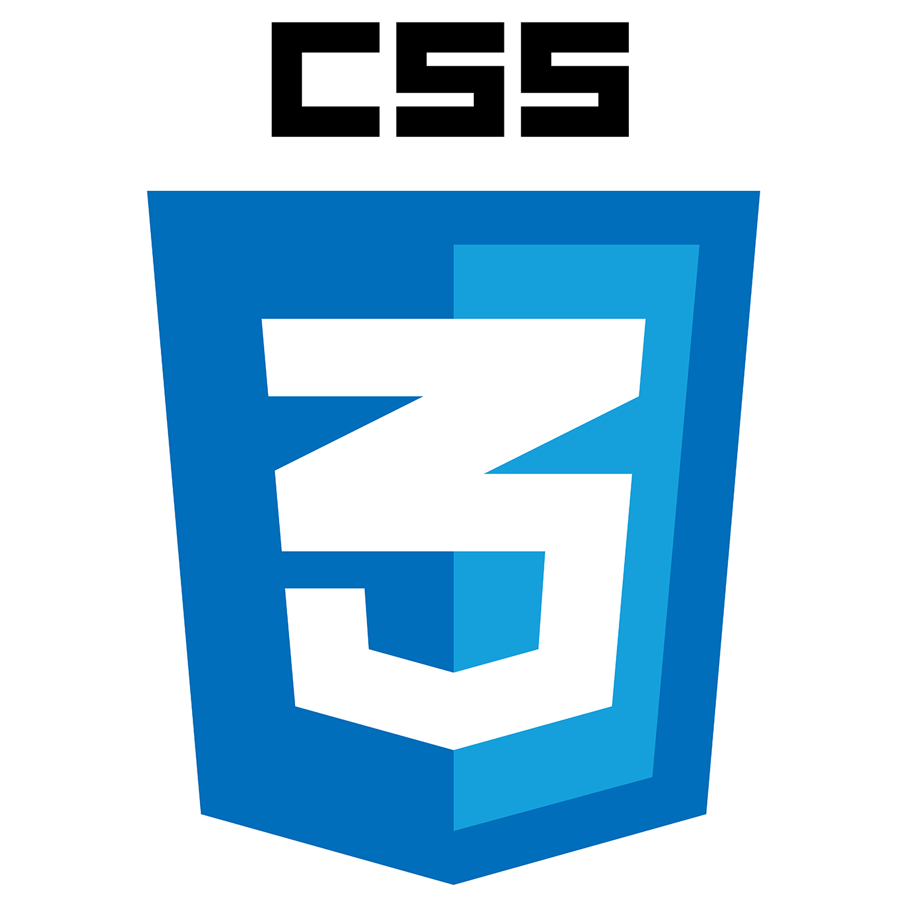

### 👏🏻Hello, Hi, नमस्कार 🙏🏻
### 🔰 I am Saksham Joshi.
- 🚩 I want to be the best.
- 👦🏻 Male/he/him .
- 🌱 Currently learning C#
 
- 
-  
-  
-  

\
**Languages :**\
<code>  </code>
<code>  </code>
<code>  </code>
<code>  </code>
<code>  </code>
<code>  </code>
<code>  </code>
<code>  </code>
<code>  </code>
<code>  </code>

<!--
**saksham-joshi/saksham-joshi** is a ✨ _special_ ✨ repository because its `README.md` (this file) appears on your GitHub profile.

Here are some ideas to get you started:

- 🔭 I’m currently working on ...
- 🌱 I’m currently learning ...
- 👯 I’m looking to collaborate on ...
- 🤔 I’m looking for help with ...
- 💬 Ask me about ...
- 📫 How to reach me: ...
- 😄 Pronouns: ...
- ⚡ Fun fact: ...
-->
